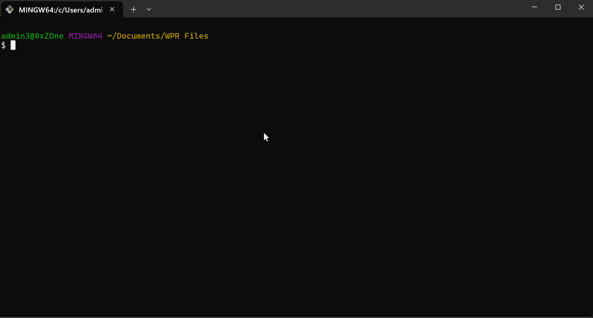

<p align="center">
  
</p>

<p align="center">
  <a href="https://github.com/tooluse-labs/wpa-mcp/actions/workflows/ci.yml"></a>
  <a href="https://github.com/tooluse-labs/wpa-mcp/releases"></a>
  <a href="LICENSE"></a>
</p>

<p align="center">
  <strong>English</strong> | <a href="README.zh-CN.md">简体中文</a> | <a href="CHANGELOG.md">Changelog</a>
</p>

---

A C# MCP server that exposes Windows ETW (`.etl`) trace analyzers — CPU, scheduler waits, image loads, file / disk / mmap / network I/O, registry, memory resources, and CLR runtime events — over any MCP-compatible client (Claude Code, Claude Desktop, Codex, Cursor). Domain-neutral: works on any Windows trace; common uses include diagnosing app startup, slow process creation, AV / EDR-induced stalls, and disk-bound regressions.

> **Status — PoC.** Broad MCP tool surface available. Windows-only (TraceEvent kernel parsers are not portable). Apache-2.0.

> **See it in action:** [a real investigation](docs/CASE_STUDIES.md) — process creation 50× slower than baseline, traced to multiple EDR stacks colliding on `PsSetCreateProcessNotifyRoutineEx`. Reproduced independently by two LLM agents on the same trace.

---

## Quickstart

<!-- Animated demo. Drop the recorded GIF at assets/quickstart-demo.gif and it
     will render here. Recording recipe: assets/quickstart-demo-recording.md -->
<p align="center">
  
</p>

Once installed ([one-liner below](#install)), ask the agent in plain language. The
server exposes a complete, paged capability map so the model can choose without
guessing or silently losing specialist tools:

```
> What can this server analyze?
(list_capabilities — 51 declared capabilities, including explicit gaps, joined
 to 15 goals, 15 workflows, and the callable tools; follow every cursor page)

> Load this trace: C:\path\to\trace.etl
(load_trace — the only raw-source entry point; snapshots an allowed local trace
 into the owned artifact store and returns a principal-scoped TraceId)

> Inspect the trace and tell me what it can answer.
(inspect_trace — use the TraceId to obtain the trace evidence map, per-domain
 stack coverage, PDB identity metadata, quality boundaries, workflows, and
 applicable tools; this does not claim local symbol readiness or frame resolution)

> Prepare the local symbols approved for this trace.
(prepare_symbols — optional; returns an immutable SymbolContextId after exact
 PDB identity verification, but still does not claim frames were resolved)

> Diagnose high wait in PID <X> between <t0> and <t1>.
(diagnose_high_wait — one window-consistent call returning candidates,
 evidence, not-concluded reasons, executed-call provenance, and next tools)

> For parent PID <X>, what was each child's kernel-side gap?
(process_create_timing — one call gives the kernel-window distribution across
 every child of one parent)

> Drill into one of the top wait frames from the evidence: who calls it?
(wait_caller_callee — caller / callee neighbors of the focus frame)
```

The same `summary → stacks → caller/callee` pattern works across stack-oriented domains — CPU (`cpu_top_functions` → `cpu_caller_callee`), file / disk / mmap I/O, image loads, CLR allocation / exception / contention, network, registry. Lifecycle and resource tools that don't fit a stack shape (memory resource snapshots, thread lifetime, process creation) have their own rows in the tables below.

For an end-to-end walkthrough — symptoms, tool chain, evidence, findings or hypotheses, and recommendations — see [`docs/CASE_STUDIES.md`](docs/CASE_STUDIES.md).

---

## Install

### One-liner (no clone, no build)

**PowerShell:**

```powershell
iex "& { $(irm https://raw.githubusercontent.com/tooluse-labs/wpa-mcp/main/scripts/install.ps1) }"
```

**Git Bash on Windows:**

```bash
curl -fsSL https://raw.githubusercontent.com/tooluse-labs/wpa-mcp/main/scripts/install.sh | bash
```

Both routes do the same thing: download the latest complete `wpa-mcp-win-x64.zip` bundle from GitHub Releases into `%USERPROFILE%\.local`, then register `%USERPROFILE%\.local\bin\wpa-mcp.exe` directly with every detected MCP client (Claude Code / Codex / Claude Desktop). No local .NET runtime or SDK is required.

### Update

Starting with `v0.4.2`, an installed bundle can update itself to the latest stable GitHub Release:

```powershell
wpa-mcp.exe update
```

The command verifies GitHub's asset digest, the immutable release evidence, the downloaded ZIP SHA-256, and the staged executable version before replacing `bin\wpa-mcp.exe` and `native\amd64`. It does not change MCP client registration. Installations older than `v0.4.2` must run the one-line installer once; if another MCP session keeps the executable locked, close that client and run `update` again.

Forward extra flags through the one-liner:

```powershell
# PowerShell — pin tag, force a client, and approve a local PDB candidate root
iex "& { $(irm https://raw.githubusercontent.com/tooluse-labs/wpa-mcp/main/scripts/install.ps1) } -Tag v0.2.24 -Client claude-desktop -SymbolLocalRoot 'C:\Symbols' -SymbolStoreRoot '$env:LOCALAPPDATA\WpaMcp\symbol-store'"
```

```bash
# Bash — flags after `bash -s --` go to install.ps1
curl -fsSL https://raw.githubusercontent.com/tooluse-labs/wpa-mcp/main/scripts/install.sh | bash -s -- -Tag v0.2.24
```

### Uninstall (one-liner, symmetric)

Web-invokable, edits the same client configs in reverse.  No download / cache touched.

```powershell
iex "& { $(irm https://raw.githubusercontent.com/tooluse-labs/wpa-mcp/main/scripts/uninstall.ps1) }"
```

```bash
curl -fsSL https://raw.githubusercontent.com/tooluse-labs/wpa-mcp/main/scripts/uninstall.sh | bash
```

This removes the `wpa-mcp` entry from every detected MCP client and deletes `%USERPROFILE%\.local\bin\wpa-mcp.exe`. The approved candidate directory and private verified-symbol store are retained.

### Requirements

- Windows 10 / 11 (TraceEvent kernel APIs are Windows-only)
- No .NET runtime is required for the one-line installer; releases ship a self-contained Windows executable.
- For verified symbol readiness: place trusted PDB candidates under the startup-approved local root, then call `prepare_symbols` for a loaded TraceId (see [Symbol configuration](#symbol-configuration)). The secure profile does not consult `_NT_SYMBOL_PATH` or fetch remote symbols, and this build does not yet resolve frames from the returned context.

<details>
<summary><strong>Install from a clone (developers)</strong></summary>

```powershell
git clone https://github.com/tooluse-labs/wpa-mcp
cd wpa-mcp
.\scripts\setup.ps1
```

```bash
git clone https://github.com/tooluse-labs/wpa-mcp
cd wpa-mcp
./scripts/setup.sh
```

Builds (Release) and registers `wpa-mcp` with every detected MCP client.  Idempotent — re-run to update.

Common flags:

```powershell
.\scripts\setup.ps1 -Client claude-desktop                    # force a specific client
.\scripts\setup.ps1 -SymbolLocalRoot "C:\Symbols" -SymbolStoreRoot "$env:LOCALAPPDATA\WpaMcp\symbol-store"
.\scripts\setup.ps1 -SkipBuild                                # use existing DLL
```

Uninstall from clone (also `-CleanBuild` to wipe `bin/` `obj/`):

```powershell
.\scripts\uninstall.ps1
.\scripts\uninstall.ps1 -CleanBuild
```

```bash
./scripts/uninstall.sh
./scripts/uninstall.sh -CleanBuild
```

</details>

<details>
<summary><strong>Install manually (custom JSON / non-standard MCP client)</strong></summary>

Build:

```powershell
git clone https://github.com/tooluse-labs/wpa-mcp
cd wpa-mcp
dotnet build -c Release
# DLL: src\WpaMcp\bin\Release\net10.0\WpaMcp.dll
```

Smoke-check:

```powershell
dotnet src\WpaMcp\bin\Release\net10.0\WpaMcp.dll --version    # prints "WpaMcp 0.4.1"
dotnet test                                                   # runs the xUnit suite (needs fixtures, see CONTRIBUTING.md)
```

Then register with your MCP client.  The command path must be **absolute**. For release installs, use `%USERPROFILE%\.local\bin\wpa-mcp.exe`; for clone builds, use `dotnet` plus the absolute DLL path.

**Claude Code** — per-project (`<project>/.mcp.json`) or global (`~/.claude.json`):

```json
{
  "mcpServers": {
    "wpa-mcp": {
      "command": "C:/Users/me/.local/bin/wpa-mcp.exe",
      "args": [
        "--symbol-local-root",
        "C:\\Symbols",
        "--symbol-store-root",
        "C:\\Users\\me\\AppData\\Local\\WpaMcp\\symbol-store",
        "--cache-size",
        "2"
      ]
    }
  }
}
```

Or via the CLI helper:

```powershell
claude mcp add wpa-mcp --scope user -- C:/Users/me/.local/bin/wpa-mcp.exe --symbol-local-root "C:\Symbols" --symbol-store-root "C:\Users\me\AppData\Local\WpaMcp\symbol-store" --cache-size 2
```

**Claude Desktop** — `%APPDATA%\Claude\claude_desktop_config.json`, same shape as above.

**Codex / Cursor / other MCP-compatible clients** — the server speaks stdio MCP; any client that accepts a `command + args` config works.  Use the same JSON snippet.

**Verify** — after restart, the client exposes the tools as `mcp__wpa-mcp__load_trace`, etc. First call to `load_trace` on a fresh `.etl` can take 30 s–3 min while the index is materialized in the owned artifact store (logged to stderr).

</details>

---

## Tools

The validated development surface contains **61 active tools**, **51 declared
capabilities**, **15 goals**, and **15 workflows**. The capability count includes
explicit declared gaps; it is exhaustive for this server catalog, not for the
complete WPA/ETW universe. Clients must follow every `tools/list` and
`list_capabilities` cursor page rather than treating page one or these snapshot
counts as the catalog. The active tool set is static for a server profile: loading
a trace never activates, removes, or reorders tools.

The server is built on the same `Microsoft.Diagnostics.Tracing.TraceEvent`
library PerfView uses. A shared parser does not imply view-for-view parity. Every
analyzer publishes the scope, source capability evidence, completeness,
precision, and conclusion boundary needed to decide what the result proves.

Capability-first clients can use `list_capabilities`; Resource-capable clients
can start from `wpa://capabilities/server`, `wpa://tools/server`, and
`wpa://workflows/server`. After selecting a tool, follow
`wpa://tools/{toolName}/sections` and all linked pages for its complete
per-section ordering, truncation-proof, evidence, measurement, relationship, and
conclusion contract. Resources lower selection cost; they do not authorize a
client to hide tools or skip `tools/list` pages.

Default `tools/list` is a lean discovery projection with an aggregate
**250,000-byte hard budget**. It keeps each tool name, description, complete
`inputSchema`, annotations, and `_meta["wpa-mcp/outputContract"]`, but deliberately
does not inline the deep `outputSchema`. That metadata carries the Contract 2.0
version, JSON Schema dialect, content-addressed URI, SHA-256, media type, and
canonical UTF-8 byte count.

Fetch a selected tool's complete schema from
`wpa://contracts/tools/{toolName}/{sha256}` and its listed pages. Tools-only
clients call `get_tool_contract(toolName, page)`, starting at page 1 and following
`nextPage`. Concatenate `schemaFragment` UTF-8 bytes in page order without a
separator or normalization, then verify `utf8Bytes` and `sha256`. Both paths are
projections of the same immutable schema that the server retains to validate
every result. They share the same fixed 8,192-UTF-8-byte page boundaries, so a
content-addressed index/page never changes with an instance's frame setting.
Startup measures every Resource and mirrored Tool page with the largest legal
request ID and fails before reading stdin when the configured response cap cannot
deliver the complete lookup (35,858 bytes for the reviewed current catalog).
The historical approximately 2.5 MB catalog measured all deep
schemas inline; it is a before-measurement, not the default catalog or LLM
context cost.

The MCP host/client—not the LLM—must traverse protocol pages, cache descriptors
and fetched contracts, and progressively inject task-relevant tool descriptors
into the model. This host-side selection does not mutate the server catalog.
wpa-mcp has no session-time tool activation and no universal dispatcher tool;
native tool names and call arguments remain unchanged.

### What wpa-mcp adds vs PerfView

* **Agent-driven, not UI-driven.** PerfView is a Windows GUI you click through; wpa-mcp is a stdio MCP server you talk to in plain language. Same data, no UI fatigue, easy to compose into CI / regression scripts.
* **Composite tools.** `diagnose_window`, `diagnose_high_wait`, `diagnose_slow_startup`, `process_create_timing`, `image_load_top_gaps` fold multi-step PerfView workflows into one call.
* **Two-level capability map.** `list_capabilities` exposes what the server declares; `inspect_trace` evaluates what one loaded trace actually supports. Missing parsed evidence is not silently upgraded into a claim about capture keywords.
* **Explicit symbol evidence.** Trace PDB identity, verified local artifact readiness, and observed frame-name resolution are separate states. `prepare_symbols` may establish the second. The current build has no context-bound TraceEvent frame resolver, so the third remains a declared gap instead of being inferred from readiness.

### Design philosophy

wpa-mcp follows one governing rule: **fully expose capability so a capability
map lowers selection cost; fully expose evidence boundaries so a structured
contract prevents LLM over-interpretation**.

* **Orientation tools** (`list_capabilities`, `load_trace`, `inspect_trace`) expose the declared server map, trace evidence map, quality gaps, and workflows before drill-down, so the model selects from facts instead of inferring from an empty result.
* **Diagnostic composites** (`diagnose_window`, `diagnose_high_wait`, `diagnose_slow_startup`) shorten the call path but preserve the evidence chain through `Evidence`, `NotConcluded`, `ExecutedToolCalls`, and `NextTools`. They deliberately do not return a synthesized "root cause" field.
* **Per-domain row and stack tools** stay close to the PerfView shape. Process-targeted tools expose the selected `(Pid, ProcessStartUs)` lifetime (or explicitly label PID aggregation), and stack tools report event-domain coverage instead of inferring stack support from unrelated events.

### Contract 2.0 evidence envelope

All 61 active tools return the same closed structured envelope. Interpret it
before interpreting domain rows:

| Field | Contract |
|---|---|
| `status`, `data`, `error`, `noData` | Separate successful data, successful no-data, partial results, and execution/delivery failure. Empty domain data has no meaning without the structured state. |
| `toolRef`, `traceRef`, `scope` | Identify the exact tool/contract, immutable trace generation and optional symbol context, and resolved process/thread/window scope. A non-`ok` selector is not an empty successful analysis. |
| `capabilityEvidence` | Separates whole-trace and scoped availability/counts, completion, and capture integrity. Scoped and trace-wide values are not interchangeable denominators. |
| `completeness`, `sections`, `hasMore` | Report each result section independently: role, returned/total state, exact sort/tie-breakers, omitted-data state, proof mode, and a cursor only when continuation really exists. |
| `evidenceBoundary` | Declares evidence IDs, measurement basis, relationship strength, conclusion status, provenance, and `doesNotProve`. Association or heuristic evidence is not causal attribution. |
| `precision` | Declares identifier and metric precision, rounding, accounting, and denominator. Public stack metrics use a checked parallel Int64 accumulator; TraceEvent's float sample metric is not projected back as an exact integer. |

Each tool's complete section contract is also published at
`wpa://tools/{toolName}/sections`. Do not apply a tool-wide order or proof claim
to heterogeneous composite sections.

If even the smallest valid success envelope cannot fit the exact frame budget,
the server returns a terminal `response_too_large` failure with `data=null`,
`scope=null`, empty `sections`/`failedSections`, and `hasMore=false`. This means
delivery failed; it does not mean the requested scope had no events, and it does
not contain a continuation.

Opaque IDs are JSON strings and must never pass through a JavaScript `number`.
Always replay a process row with `pid + processStartUs`; for a thread preserve
`pid + processStartUs + tid + threadStartUs + threadGeneration`.

In the secure ID-only profile, 58 analysis/discovery tools are advertised
read-only, idempotent, closed-world, and non-destructive. `load_trace` writes the
owned artifact store, `prepare_symbols` may populate the private verified-symbol
store, and `unload_trace` retires a handle. The selected startup profile and its
projected annotations are authoritative; inspect `wpa://runtime/profile` rather
than assuming every profile has the same side effects.

### Usage pattern

Call `list_capabilities` first when the server surface is unfamiliar. For trace
analysis, **always call `load_trace` before a trace query** and use the returned
TraceId. It snapshots an allowed local source into the server-owned artifact
store and returns parsed evidence; those observations are not proof of the
original capture-keyword configuration. `inspect_trace` then projects the
trace-specific evidence map. The parsed domains include:

* **CPU sampling and scheduling** — `HasCpuSamples`, `HasCSwitch`, `HasReadyThread`, `HasStackWalks`
* **File / disk / mmap I/O and loader** — `HasFileIo`, `HasDiskIo`, `HasHardFaults`, `HasImageLoad`
* **Memory** — `HasVirtualAlloc`, `HasNtHeap`, `HasMemoryProcessInfo`, `HasHandleEvents`, `HasPoolEvents`
* **Network** — `HasNetIo`, `HasNetConnections`
* **Kernel infrastructure** — `HasRegistry`, `HasInterrupt`, `HasAlpc`, `HasThreadEvents`
* **CLR runtime** — `HasClrGc`, `HasClrJit`, `HasClrAlloc`, `HasClrException`, `HasClrContention`

`HasStackWalks` is a compatibility-wide union only. Before using a stack result, inspect that domain's `StackCoverage`: event coverage (`TotalEventCount`, `StackedEventCount`, `StackCoveragePct`), metric-weighted coverage (`TotalMetric`, `StackedMetric`, `MetricStackCoveragePct`), and `CoverageState` (`no_events`, `no_stacks`, `partial`, or `full`). `StackSemantics` identifies the exact stack source. In particular, the `cswitch` domain uses the switch-out `BlockingStack`; the debug stack probe's ordinary CSwitch `CallStackIndex` is a different stack and can have a different coverage. A synthetic `?!?` row accounts for unstacked events; `ContainsSyntheticUnknown` reports whether the current result contains one, and it is never a real call chain.

The full call flow:

```
list_capabilities ──► declared capabilities + goals + workflows

.etl source ──► load_trace ──► TraceId ──► inspect_trace evidence map
                              │
                              ├────► composite / domain query (unsymbolized)
                              │
                              └────► optional prepare_symbols
                                          │
                                          ▼
                                  SymbolContextId (readiness only)
                                  resolveSymbols=true currently
                                  fails symbol_resolution_unavailable

  Composite  (recommended for known workflows)
  ─────────────────────────────────────────────
  diagnose_window, diagnose_slow_startup, diagnose_high_wait
  returns Evidence + NotConcluded + ExecutedToolCalls + NextTools
                                                          │
                                                          │  via NextTools
                                                          ▼

  Domain drill  (custom investigation or composite follow-up)
  ────────────────────────────────────────────────────────────
  summary  ──►  stacks  ──►  caller_callee
  top-N         top-N         focus-frame
  rows          call chains   drill

  Example: file_io_top_files  ──►  file_io_top_stacks  ──►  file_io_caller_callee
```

For common workflows, prefer composites such as `diagnose_window`,
`diagnose_high_wait`, and `diagnose_slow_startup` before manually stitching
individual calls together. Their section and evidence contracts show what ran,
what could not be concluded, and where to drill down. Composites are currently
directly executed and are not evidence of a single shared planner dispatch.

Where a domain exposes all three layers, it follows this shape: a **summary**
(top-N flat rows), a **stacks** view (top-N call stacks weighted by the metric),
and a **caller-callee drill-down** (given a focus frame, returns its caller /
callee neighbors weighted by the same metric — the same shape as PerfView's
"Callers" / "Callees" tabs). CPU is different: drill directly from
`cpu_top_functions` to `cpu_caller_callee`; there is no active
`cpu_top_stacks` tool.

In the tables below, "PerfView equivalent" is the matching view in PerfView's GUI. Entries tagged **[Composite]** combine multiple PerfView views into one call, **[Manual filter]** expose raw events that PerfView's Events view shows but doesn't pre-aggregate, and **[Programmatic]** replace a GUI dialog with structured JSON. Most other tools are 1:1 mappings of PerfView views.

### Time-window semantics

Tools that accept `startUs` and `endUs` use a half-open interval: an event is included only when `startUs <= timestamp < endUs`. A null boundary means the trace start or trace end respectively.

For PID-targeted tools, pass `processStartUs` from `list_processes` whenever the PID was reused. A PID-only aggregate explicitly reports `ScopeMode=pid_aggregate` and retains the included lifetime keys in `IncludedProcesses`; rows/totals may combine those lifetimes according to the tool-specific accounting contract. Exact-only tools return structured `ScopeStatus/NoDataReason=process_start_required` for clean reuse, with replayable candidates. `ambiguous_process_instance` is reserved for unsafe/conflicting lifetime evidence. Check `ScopeStatus`, `CapabilityStatus`, `MatchedEventCount`, `NoDataReason`, `PidReuseObserved`, and `IncludedProcesses` before interpreting an empty `Rows` array. `CapabilityStatus=observed` means source events matched the resolved requested scope; `not_observed` is reserved for an established unfiltered/global absence; otherwise the value is `unknown`.

For CPU/Wait tools that also accept `tid`, reuse is resolved with `threadStartUs` and the optional `threadGeneration`. Missing or ambiguous thread selectors return structured `scope_not_found` / `ambiguous_thread_instance` results rather than falling back to PID-only data. `IncludedThreads` contains `ThreadStartUs`, `ThreadEndUs`, and `Thread.Generation`; replay a candidate with `pid + processStartUs + tid + threadStartUs + threadGeneration`. Generation disambiguates rare capture-boundary lifetimes whose inferred start timestamps are equal.

Tools without `startUs` / `endUs` operate on intentionally different scopes; each tool's MCP description states which:

* **Server catalog** — `list_capabilities` has no trace scope.
* **Trace/symbol lifecycle** — `load_trace` accepts the raw source and returns a TraceId; `prepare_symbols` accepts that TraceId and returns a SymbolContextId; `unload_trace` retires only the public handle.
* **Whole-trace orientation/query** — `inspect_trace`, `list_processes`, and `find_marker` operate on the loaded immutable trace generation.
* **Lifecycle views** — `process_create_timing`, `thread_lifetime`, `image_load_timing`, `image_load_top_gaps`, and `diagnose_slow_startup` use process-start or lifecycle-relative windows instead of an arbitrary trace window.
* **Whole-trace or windowed by-file summaries** — `file_io_top_files` and `hard_fault_by_file` aggregate over file names and support explicit `startUs` / `endUs` windows. Use the corresponding stack tools for event-associated call-chain evidence.

### Meta

| Tool | What it does | PerfView equivalent |
|---|---|---|
| **`list_capabilities`** | Paged Server Capability Map: declared capabilities (including explicit gaps), goals, workflows, callable tools, cost/scope/symbol requirements, and evidence boundaries. It is exhaustive for this server catalog, not for WPA. | **[Programmatic]** — no direct GUI equivalent |
| **`get_tool_contract`** | Deterministic 8,192-byte pages of one active tool's canonical Contract 2.0 output schema for Tools-only clients. Reassemble pages and verify the advertised size/SHA-256. | **[Programmatic]** — no direct GUI equivalent |
| **`load_trace`** | The only raw trace-source entry point. Validates an allowed local `.etl`/`.etlx`, snapshots an opened handle into the owned immutable artifact store, and returns a canonical principal-scoped TraceId. Parsed event count is not the raw ETW record count. | Open a trace file (no TraceId equivalent) |
| **`unload_trace`** | Retires a TraceId, rejects new acquisitions, and optionally waits for leases. It does not delete the immutable artifact and does not claim physical cleanup. | Close a trace handle |
| **`inspect_trace`** | Paged Trace Evidence Map: parsed capability assessments, system metadata, provider counts, same-domain stack coverage, trace PDB identities, quality boundaries, self-attribution state, applicable tools, and workflows. It neither probes local PDB files nor measures frame resolution; use `prepare_symbols` only for verified local readiness. Context-bound frame lookup remains unavailable in this build. | **[Programmatic]** — replaces manual trace-quality inspection across Events, Modules, and capture metadata |
| `list_processes` | Cursor-pages the complete process-lifetime inventory (sortable by `cpu` / `wall` / `wait_ratio`); follow every `nextCursor` with the same query. `WaitRatio = WallUs / CpuUs` ranks "high wall, low CPU" candidates; the ratio does not identify what they waited on. PID 0 (Idle) and PID 4 (System) are hidden by default. | Processes view |
| `process_create_timing` | Per-child timing for a parent process lifetime. `FirstImageLoadOffsetUs` is the observed interval between `ProcessStart` and the first DLL load. It can include callbacks, scanning, suspension, scheduling, and other work; the interval alone does not identify a mechanism or root cause. | **[Composite]** — Processes + Events + Excel; see [`docs/CASE_STUDIES.md`](docs/CASE_STUDIES.md) |
| `thread_lifetime` | Per-PID chronological thread lifecycle: every `ThreadStart` / `ThreadStop` with `StartTimeUs`, `EndTimeUs`, `LifetimeUs`, and `PeakConcurrentThreads`. Catches thread-pool thrash and fork-bomb patterns. `TraceResidentStart/End` flags threads bounded by trace capture rather than real spawn / exit. | **[Manual filter]** — Events view, filter on `Thread/Start` + `Thread/Stop`, pair by hand |

### CPU stacks

| Tool | What it does | PerfView equivalent |
|---|---|---|
| `cpu_top_functions` | Top-N hot functions by exclusive CPU samples in a window / for a PID.  Optional `excludeEtwSelfOverhead` folds `EtwpLogKernelEvent` etc. into a single `[ETW Overhead]` bucket. Filtered calls omit `*PctOfTrace` by default to avoid an extra whole-trace CPU sample-count pass; set `includeTracePct=true` when those columns matter. | CPU Stacks → ByName |
| `cpu_precise_analysis` | CSwitch + ReadyThread scheduler summary: exact on-CPU microseconds, ready-to-run latency, per-core runtime attribution, and quantum/preemption counters by thread. Use when sampled CPU cannot answer "how long did it actually run?" or "how long was it ready before dispatch?" | CPU Usage (Precise) |
| `cpu_top_functions_batch` | Same as above for multiple PIDs in one shared sampled-profile scan. Each PID gets an independent CallTree. Complete `scopeResults` rows are cursor-paged from a bounded immutable snapshot, so continuation never rescans the trace. | **[Composite]** — batch variant, saves N round-trips through CPU Stacks → ByName |
| `cpu_caller_callee` | Drill into a focus frame: callers (frames calling INTO it) and callees (frames it calls OUT to), each ranked by inclusive CPU samples. Recursion-safe. | CPU Stacks → Callers / Callees tabs |

### Wait / blocked time (CSwitch-derived)

Requires the `CSwitch` kernel keyword (default WPR `CPU` profiles include it).

| Tool | What it does | PerfView equivalent |
|---|---|---|
| `wait_analysis` | Per-thread blocked time + observed wait reasons. Reasons such as `WrFilterContext` identify the scheduler wait state; they do not by themselves identify the responsible component or root cause. The response separates trace-wide and scoped CSwitch counts and scoped stack coverage. | Thread Time → blocked-time per thread |
| `wait_top_stacks` | Top-N call stacks ranked by blocked μs, built from the blocking stack attached to selected switch-out `ThreadCSwitch` intervals. This is code-path evidence associated with blocked time; it does not identify the responsible external component or root cause. | Thread Time / Wait Time → BlockedTime metric (`ThreadTimeStackComputer`) |
| `wait_caller_callee` | Drill into a focus frame; metric is blocked μs. | Thread Time → Callers / Callees tabs |

### Image / DLL load

| Tool | What it does | PerfView equivalent |
|---|---|---|
| `image_load_timing` | Per-process-lifetime chronological list of every `ImageLoad` event with offset from `ProcessStart`. It reveals late loads and long intervals, but an interval alone cannot attribute the delay to a minifilter, signature scan, or another mechanism. | **[Manual filter]** — Events view, filter on `ImageLoad`, compute offsets by hand |
| `image_load_top_gaps` | Top-N largest **gaps** between consecutive image loads. Pairs with the chronological view; same data, ranked by gap. Response also carries `FirstLoadOffsetUs` (kernel-side fork tax before any DLL loads). | **[Manual filter]** — same `ImageLoad` filter as above, sort by inter-event delta |
| `image_load_top_stacks` | Top-N call stacks ranked by `ImageLoad` event count.  Distinguishes eager loads (`LoadLibraryEx` in a main initialiser) from lazy / cascading loads (`CoCreateInstance`, `AmsiOpenSession`, EDR-injected providers). | Image Load Stacks |
| `image_load_caller_callee` | Drill into a focus frame; metric is image-load count. | Image Load Stacks → Callers / Callees tabs |

### File / disk / mmap I/O

The three layers cover different parts of the I/O stack — diff them to localise where time actually goes.

| Tool | What it does | PerfView equivalent |
|---|---|---|
| `file_io_top_files` | Top-N files by total `read + write` bytes. | File I/O view → ByFile |
| `file_io_top_stacks` | Top-N stacks by file-IO bytes. Captures **all** syscalls including cache-served reads — diff with `disk_io_top_stacks` to find cache hits. Requires the `FileIO` keyword (default `CPU.light` omits it). | File I/O Stacks |
| `file_io_caller_callee` | Drill on a focus frame; metric is file-IO bytes. | File I/O Stacks → Callers / Callees tabs |
| `disk_io_top_stacks` | Top-N stacks by **physical** disk-IO bytes — only events that hit physical media (no cache).  Requires the `DiskIO` keyword. | Disk I/O Stacks |
| `disk_io_caller_callee` | Drill on a focus frame; metric is physical disk bytes. | Disk I/O Stacks → Callers / Callees tabs |
| `hard_fault_by_file` | Top-N files by **hard page-in** bytes, optionally scoped by `startUs` / `endUs`. Most hard faults are mmap'd files being touched for the first time (DLLs, data files, network-share content); some also come from paged-out heap/stack pages and the page file. Rows include `MaxLatencyTimeUs`, so follow-up analysis can zoom into the exact worst page-in stall. Requires the `HardFaults` keyword (NOT in default WPR profiles — see [`docs/WPR_PROFILE.md`](docs/WPR_PROFILE.md)). | Memory Hard Fault → ByFile |
| `hard_fault_top_stacks` | Top-N event-attached stacks by hard-fault page-in bytes. These stacks support hypotheses about eager/lazy access or concurrent scanning; they do not by themselves establish the higher-level cause. | Memory Hard Fault Stacks |
| `hard_fault_caller_callee` | Drill on a focus frame; metric is page-in bytes. | Memory Hard Fault Stacks → Callers / Callees tabs |

### Virtual memory

| Tool | What it does | PerfView equivalent |
|---|---|---|
| `memory_resource_analysis` | Process memory resource snapshots from `Memory/ProcessMemInfo`: working set, commit, derived private bytes, private working set, virtual size, observed handle create/close deltas, and observed pool allocation/free deltas. Requires `MemoryInfoWS`, `Handle`, and `Pool`; use `MemoryCapture.wprp`. Rows are ordered by resource size/delta, not severity or causality. Pool rows are captured-window deltas, not absolute current counters. | Memory / Handles views |
| `virtual_alloc_top_stacks` | Top-N stacks by observed `VirtualMemAlloc` + `VirtualMemFree` operation bytes. Allocated and freed bytes/counts are reported separately, with total operation traffic and observed net operation bytes. This is not live virtual size, commit, retention, or leak accounting. Requires the `VirtualAlloc` kernel keyword (NOT in default WPR `CPU` profiles). | VirtualAlloc Stacks |
| `virtual_alloc_caller_callee` | Drill on a focus frame; metric is virtual-memory bytes. | VirtualAlloc Stacks → Callers / Callees tabs |
| `heap_alloc_top_stacks` | Top-N stacks by **NT-heap** allocation bytes (`RtlAllocateHeap` / `HeapAlloc` / `malloc` / `new`). This is allocation flow, not retained-memory or leak proof: free events carry no size and are not counted. Distinct from VirtualAlloc; splits `AllocBytes` / `ReallocBytes`. Requires the `Heap` provider enabled **per-process**. | HeapAllocStacks |
| `heap_alloc_caller_callee` | Drill on a focus frame; metric is NT-heap bytes. | HeapAllocStacks → Callers / Callees tabs |

### Network I/O

| Tool | What it does | PerfView equivalent |
|---|---|---|
| `net_top_stacks` | Top-N stacks by network bytes — TCP + UDP, IPv4 + IPv6 send/recv merged. Splits `TcpBytes` / `UdpBytes` in the response.  Pairs well with `wait_analysis` for "high wall, low CPU" cases where the wait is on a network round-trip. `Connect` / `Accept` / `Disconnect` events have no byte metric — use `find_marker` for those. Requires the `NetworkTrace` keyword (NOT in default `CPU` profiles). | TCP/IP Stacks + UDP/IP Stacks (merged) |
| `net_caller_callee` | Drill on a focus frame; metric is network bytes. | TCP/IP Stacks → Callers / Callees tabs |
| `net_connections` | Per-connection lifecycle list — Connect/Accept paired with Disconnect/Reconnect by `connid` to give "connection X opened at T1, closed at T2, lasted T2−T1". It finds unusually long observed lifecycles; the duration is not connection-establishment latency, request/response latency, or RTT, so it cannot by itself attribute a slow RPC to setup. IPv4 + IPv6 are merged with an `IsIPv6` flag. Connections still open at trace end have `TraceResidentEnd=true`. | **[Manual filter]** — Events view, pair `TcpIp/Connect` with `TcpIp/Disconnect` by `connid` by hand |

### Registry

| Tool | What it does | PerfView equivalent |
|---|---|---|
| `registry_top_stacks` | Top-N stacks by registry-operation count (Query / Open / Create / SetValue / EnumerateKey / etc.). Useful for "who's pounding the registry on every hot-path call". Metric is op count (no natural byte cost for registry). Requires the `Registry` keyword (NOT in default `CPU` profiles). | Registry Stacks |
| `registry_caller_callee` | Drill on a focus frame; metric is registry op count. | Registry Stacks → Callers / Callees tabs |

### ReadyThread (association evidence)

| Tool | What it does | PerfView equivalent |
|---|---|---|
| `ready_thread_top_stacks` | Top-N associated **readier/wakeup** stacks, aggregated by optional `awakenedPid` and the requested window. The stack belongs to the readier, not the awakened thread. These events are not paired one-to-one with a specific wait interval or subsequent CSwitch and cannot alone establish root cause. Use with `wait_analysis` as supporting evidence. | ReadyThread Stacks |
| `ready_thread_caller_callee` | Drill into the same associated readier/wakeup evidence around a focus frame; metric is ready-event count and carries the same non-causal limitation. | ReadyThread Stacks → Callers / Callees tabs |

### Interrupts (DPC / ISR)

| Tool | What it does | PerfView equivalent |
|---|---|---|
| `interrupt_top_stacks` | Top-N stacks by observed kernel interrupt time (DPC + ISR microseconds), split into `DpcUs` / `IsrUs`. Interpret concentration and CPU share against comparable workload/hardware baselines; there is no universal healthy threshold here, and a hot routine alone does not establish a driver fault. Requires `Interrupt` + `DPC` keywords (default `CPU` profiles enable both). | DPC/ISR Stacks |
| `interrupt_caller_callee` | Drill on a focus frame; metric is interrupt μs. | DPC/ISR Stacks → Callers / Callees tabs |

### ALPC (cross-process IPC)

| Tool | What it does | PerfView equivalent |
|---|---|---|
| `alpc_top_stacks` | Top-N stacks by ALPC message count (Send + Receive). ALPC is the kernel IPC primitive used by RPC, COM, AppContainer broker calls, lsass, the SCM, and much of the Windows service surface. It identifies call chains associated with message activity; message counts alone do not measure a round-trip or explain latency. Requires the `ALPC` keyword (NOT in default `CPU` profiles). | ALPC Stacks |
| `alpc_caller_callee` | Drill on a focus frame; metric is ALPC message count. | ALPC Stacks → Callers / Callees tabs |

### CLR (.NET runtime)

Requires the `Microsoft-Windows-DotNETRuntime` ETW provider in the capture profile (WPR `.wprp` files need an explicit `<EventCollectorId>` for it).
For minimal JIT-only traces, run `tests/WpaMcp.Tests/fixtures/Capture-JitOnly.ps1` or use `JitOnlyCapture.wprp!ClrJitOnly`; it enables the CLR JIT + Loader bits needed by `clr_jit_analysis` without GC/allocation/exception/contention runtime keywords.

| Tool | What it does | PerfView equivalent |
|---|---|---|
| `clr_gc_analysis` | Per-GC wall and stop-the-world pause intervals, paired over the whole trace before projection into the requested window. `DurationUs` / `PauseUs` and `TotalGcUs` / `TotalPauseUs` are compatibility aliases for accounted clipped overlap; `FullDurationUs` / `FullPauseUs` and `TotalFullGcUs` / `TotalFullPauseUs` preserve complete paired interval values. `GCStart`→`GCStop` brackets the wall interval; `GCSuspendEEStart`→`GCRestartEEStop` brackets the mutator pause. | GCStats |
| `clr_jit_analysis` | Top-N methods by JIT compilation duration. Matches `MethodJittingStarted`→`MethodLoadVerbose` on `(ProcessInstanceKey, ClrInstanceId, MethodId)` over the whole trace, then projects into the requested window. `JitDurationUs` is the accounted clipped-overlap alias and `FullDurationUs` is the complete paired duration; `MethodIlSize` is IL byte size, not generated native-code size. R2R / NGen / pre-jitted methods don't fire `JittingStarted`, so they're invisible. | JIT Stats |
| `clr_alloc_top_stacks` | Top-N stacks by managed-heap allocation bytes, driven by `GCAllocationTick` events (one per ~100 KB allocated per `(heap, generation, type)` — sampled, low-overhead, on every CLR ≥ 4.0). Response includes `TopTypes` (top type names by total bytes). The canonical "who's allocating all the strings on the request hot path" tool. Requires the `GC` keyword. | GC Heap Alloc Stacks |
| `clr_alloc_caller_callee` | Drill on a focus frame; metric is allocation bytes. | GC Heap Alloc Stacks → Callers / Callees tabs |
| `clr_exception_top_stacks` | Top-N stacks by .NET exception throw count (`ExceptionStart` events). Useful for "is this code path throwing 1000 exceptions per second" / "where is `FormatException` being swallowed in a retry loop". Response includes `TopTypes` (top exception type names by count). Requires the `Exception` keyword. | Exceptions Stacks |
| `clr_exception_caller_callee` | Drill on a focus frame; metric is exception count. | Exceptions Stacks → Callers / Callees tabs |
| `clr_contention_top_stacks` | Top-N stacks by managed-monitor blocked μs — `lock` / `Monitor.Enter` waits. Matches `ContentionStart`→`ContentionStop` by `ThreadInstanceKey` (process lifetime + TID generation), then charges only overlap with the requested window; `TotalFullBlockedUs` preserves complete paired time. Only completed pairs contribute blocked-time metrics and stack coverage. Filters to `ContentionFlags.Managed` (native contention is excluded). Requires the `Contention` keyword. | Monitor Contention Stacks |
| `clr_contention_caller_callee` | Drill on a focus frame; metric is blocked μs. | Monitor Contention Stacks → Callers / Callees tabs |
| `clr_gc_heap_stats` | Managed-heap snapshot timeline with heap-generation sizes, pinned-object count, and GC-handle count. Use it to identify trends; an upward trend alone is not proof of a leak or an object-retention path. Pairs with `clr_gc_analysis`. | GCStats per-GC snapshot table |
| `clr_finalizer_analysis` | Top types observed being finalized + finalizer-thread execution batches. Aggregates `GCFinalizeObject` by `TypeName` and pairs `GCFinalizersStart`→`GCFinalizersStop`. Batch duration is not automatically an application pause. This supports investigating whether finalizer work overlaps GC delays; it does not by itself attribute a slow GC or identify allocation sites. | **[Composite]** — GCStats fields + Events view filtering combined into one call |

### Markers / generic ETW events

| Tool | What it does | PerfView equivalent |
|---|---|---|
| `find_marker` | Search all materialized ETW events whose name or task contains a substring. Default mode `count_by_event` returns a histogram; `count_by_process` and `rows` expose more detail. It can surface Defender / EDR provider events such as `AMFilter_FileScan`, but event presence is not a duration or performance-causality claim. Empty results return `no_name_match`. | Events view |
| `security_scan_analysis` | Aggregates known Defender scan schemas plus scan-like vendor/provider events. PID means payload target PID; missing target identity uses an explicitly marked emitter fallback. `EvidenceKind`, `Provenance`, and `Confidence` separate paired high-confidence schemas from low-confidence name heuristics. Presence, vendor classification, and timing overlap do not by themselves prove an AV scan or performance root cause. Used by `diagnose_window`. | **[Composite]** — paired Defender events + heuristic Events-view evidence |
| `generic_event_top_stacks` | Top-N stacks by event count for **any** user-mode ETW provider — AspNetCore, Kestrel, EFCore, Antimalware-AMFilter, Sense (Defender for Endpoint), `Microsoft-Windows-DxgKrnl` (GPU), `Microsoft-Windows-Kernel-Power` (CPU frequency / C-state), or any custom EventSource. Use `find_marker` first to identify which providers are in the trace, then plug the exact `ProviderName` here. Optional `eventNameSubstring` narrows to a specific event class. Stack quality depends on whether stack-walks were enabled for the provider in the `.wprp`. | Any Stacks (single-provider) |
| `generic_event_caller_callee` | Drill on a focus frame; metric is event count. | Any Stacks → Callers / Callees tabs |

### Composite diagnostics

| Tool | What it does | PerfView equivalent |
|---|---|---|
| `diagnose_window` | Windowed evidence composite for one `startUs` / `endUs` interval, optionally scoped to one PID. It returns hard-fault by-file rows sorted by bytes and max latency, file IO top files, memory-pressure summary, security-scan evidence, wait rows, executed-call provenance, not-concluded reasons, and optional zoom-in tools. It has a `maxWindowDurationUs` guard and intentionally returns no root-cause verdict. | **[Composite]** — wraps hard faults, file IO, memory, security scan, and wait views |
| `diagnose_high_wait` | Preview composite for high blocked-time investigations. It keeps candidates separated by process lifetime, adds stack evidence only when scoped CSwitch stack coverage supports it, and treats ReadyThread stacks as associated wakeup evidence rather than proof of who caused a wait. It returns explicit not-concluded reasons and no root-cause field. | **[Composite]** — wraps wait, stack, and ReadyThread views with evidence provenance |
| `diagnose_slow_startup` | Picks slowest-by-wait-ratio processes (or matches `nameSubstring`), then runs `wait_analysis` + `image_load_timing` + `cpu_top_functions` for each startup window. When a candidate's `ProcessStart -> first ImageLoad` gap meets `slowFirstImageLoadThresholdUs`, it also attaches `FirstImageLoadGapEvidence` from `diagnose_window` for that exact pre-user-mode gap. | **[Composite]** — wraps startup wait, loader, CPU, and window evidence |

### Symbols

| Tool | What it does | PerfView equivalent |
|---|---|---|
| `prepare_symbols` | For an already-loaded TraceId, evaluates the complete trace-native PDB identity set against startup-approved local candidate roots, verifies exact name/GUID/age, pins matching artifacts in a private store, and returns an immutable SymbolContextId. It performs no network access and does not claim frame resolution. The current context-bound frame resolver is unavailable. | **[Programmatic]** — explicit local symbol preparation lifecycle |

---

## Configuration

### Contract and trace-reference profile

The result contract and trace-reference policy are selected once, before the
stdio transport reads requests. A tool call cannot change either mode. The
selected profile and all deprecation/release blockers are available to MCP
clients at `wpa://runtime/profile`.

```json
{
  "env": {
    "WPAMCP_CONTRACT_MODE": "2.0",
    "WPAMCP_TRACE_REFERENCE_MODE": "id_only"
  }
}
```

Equivalent command-line options are `--contract-mode 2.0` and
`--trace-reference-mode id_only`; command-line values override environment
values. Accepted contract values are exactly `legacy` and `2.0`. Accepted trace
reference values are `compatibility` and `id_only`.

The source tree is version `0.4.2` and uses the release-eligible Contract 2.0 +
ID-only default profile. Contract 2.0 is its only result shape. No released
wpa-mcp version established the Phase 0 snapshot as a supported legacy wire
contract. The `legacy` value is recognized
only to fail closed instead of mislabeling a Contract 2.0 envelope, and the lack
of an unshipped legacy adapter does not block a Contract 2.0-native 0.4.x
release. Raw-path compatibility remains available only through an explicit
startup switch and emits a removal warning for 1.0.0.
See [contract migration](docs/CONTRACT_MIGRATION.md) and
[client compatibility](docs/CLIENT_COMPATIBILITY.md) before pinning a profile.

For diagnostics, `--runtime-profile` prints the default profile as JSON;
`--validate-release-profile` returns zero for the default 0.4.2 profile and exit
code 78 whenever an ADR rollout gate is blocked. These commands do not start
MCP or read stdin.

### Trace cache

LRU, default capacity 2 materialized trace generations. Override with
`WPAMCP_CACHE_SIZE=N`. `load_trace` snapshots an allowed source handle and
materializes only inside the owned artifact store; query tools accept TraceId in
the secure profile and never create an adjacent caller-owned `.etlx`. A query
holds a generation lease for its complete use. Eviction, unload, or shutdown
retires the handle and disposes the backend only after the final lease drains.
Concurrent construction and trace-facts extraction are single-flight per
generation.

Repeated loads of the same observed generation return the same canonical handle.
`forceRefresh=true` exists for a deliberate in-place rewrite that preserved
observable identity, length, and timestamps. `unload_trace` retires the public
handle; it does not immediately delete the immutable artifact. Unpinned trace
artifacts expire seven days after their last store access by default. Set
`WPAMCP_TRACE_ARTIFACT_RETENTION_MINUTES` or
`--trace-artifact-retention-minutes` at startup to a value from 1 minute through
365 days. A live handle pins its object, so TTL cannot invalidate an active
generation; an expired object is removed after the last pin drains and is not
silently resurrected by the generation cache. Retained-store quotas and
materialization checkpoints are enforced, but the converter's transient
physical disk peak is not hard-limited. Version 0.4.x explicitly accepts and
discloses that residual risk without claiming a whole-root hard bound.

### Capturing your own traces

See [`docs/WPR_PROFILE.md`](docs/WPR_PROFILE.md) for a recommended `.wprp` that captures CPU + CSwitch + FileIO + DiskIO + HardFaults + Loader stacks.  Quick canonical capture:

```powershell
wpr.exe -start tests\WpaMcp.Tests\fixtures\MmapCapture.wprp -filemode
# … reproduce the slow case …
wpr.exe -stop C:\path\to\my_capture.etl
```

### Symbol configuration

> **Keep readiness separate from resolution.** The four states are trace PDB
> identity (name + GUID + age), local candidate discovery, verified local
> readiness, and observed frame-name resolution. `prepare_symbols` can establish
> readiness and intentionally reports resolution as unmeasured. The current
> context-bound TraceEvent frame resolver is not available, so no active query
> may upgrade readiness into measured resolution. A null rate is not 0%.

#### Startup policy

The secure policy is local-only. It does not read `_NT_SYMBOL_PATH`, inspect the
trace directory, search arbitrary paths, contact a symbol server, or accept roots
inside a tool call. Configure one or more absolute local candidate roots and a
disjoint private verified store before startup:

```powershell
wpa-mcp.exe --symbol-local-root "C:\Symbols" `
  --symbol-store-root "$env:LOCALAPPDATA\WpaMcp\symbol-store"
```

Equivalent environment variables are `WPAMCP_SYMBOL_LOCAL_ROOTS` (semicolon-
separated on Windows) and `WPAMCP_SYMBOL_STORE_ROOT`. If candidate roots are
enabled, a store root is required. UNC/device/alternate-stream paths are denied,
and the candidate roots and store may not contain one another. The installer
configures `%LocalAppData%\WpaMcp\symbol-candidates` and
`%LocalAppData%\WpaMcp\symbol-store` by default.

Place PDBs at either `<root>\<pdbName>` or the symbol-store-shaped
`<root>\<pdbName>\<GUIDAge>\<pdbName>`. Acquire public/private PDBs outside
wpa-mcp and copy them into an approved root; the MCP server itself performs no
remote fetch. Each candidate is opened and must match the trace's complete PDB
name/GUID/age identity before it is copied into and pinned from the private
verified store.

#### Build prerequisites for your own DLLs

An approved local root cannot help if the build never produced a PDB, or if the PDB and deployed DLL are from different builds.

- **.NET / C#**: `<DebugType>portable</DebugType>` + `<DebugSymbols>true</DebugSymbols>`. Check that Release configurations don't disable PDB output.
- **C++ (MSVC)**: `/Zi` + `/DEBUG:FULL`, even in Release. Keep PDB next to DLL.
- PDB and DLL must share the same signature (GUID + age) — re-link → new signature → old PDB no longer resolves.

#### Verifying it worked

```
> Load C:\my\trace.etl and keep the returned TraceId.
> Run prepare_symbols for that TraceId and keep the returned SymbolContextId.
> Inspect prepare_symbols readiness; do not interpret it as resolved functions.
```

The SymbolContextId is bound to the principal, trace generation, policy,
resolver, privacy/contract profile, module identities, and verified artifacts.
The intended lookup contract requires stack queries to supply it explicitly with
`resolveSymbols=true`; there is no ambient fallback. In this build that request
fails closed with `symbol_resolution_unavailable` /
`context_bound_frame_resolution_unavailable` because the context-bound
TraceEvent adapter is not implemented. `symbols.frame_resolution.measured`
therefore remains a declared gap; unsymbolized results and preparation metadata
must not be presented as a measured resolution rate.

Architecture and compatibility boundaries are documented in
[`docs/ARCHITECTURE.md`](docs/ARCHITECTURE.md),
[`docs/CONTRACT_MIGRATION.md`](docs/CONTRACT_MIGRATION.md), and
[`docs/CLIENT_COMPATIBILITY.md`](docs/CLIENT_COMPATIBILITY.md).
